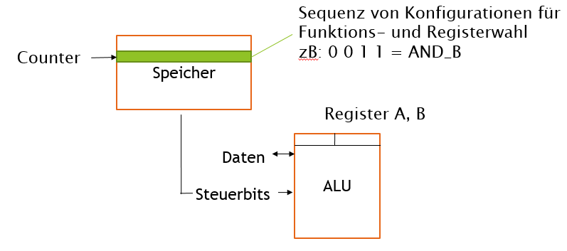
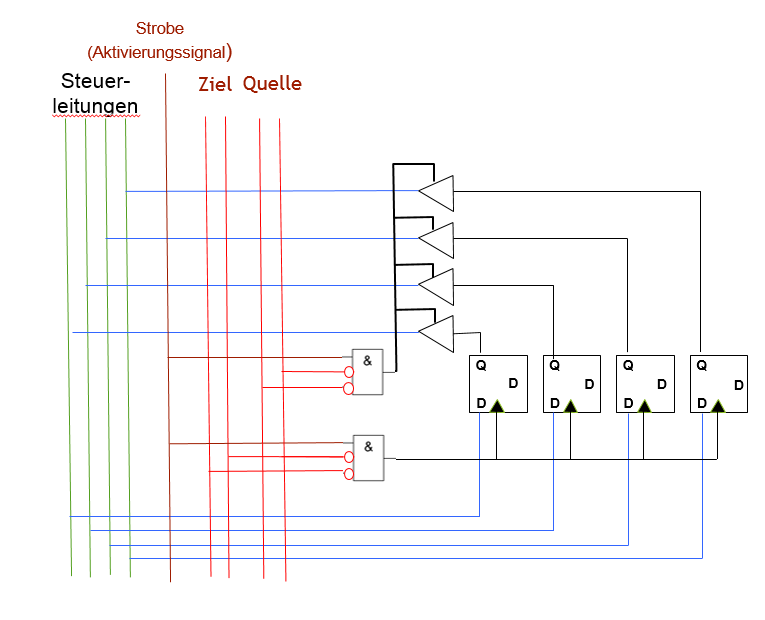
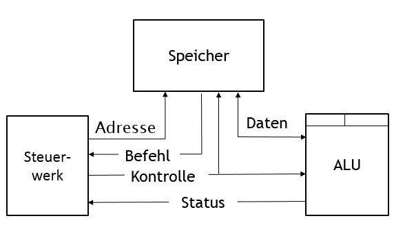

<!--

author:   Sebastian Zug
email:    zug@ovgu.de   
version:  0.0.1
language: de
narrator: Deutsch Female

import: https://raw.githubusercontent.com/liaScript/rextester_template/master/README.md


@logic_emu: @logic_emu_(@uid)

@logic_emu_
<script>
/** @constructor */
function LZ77Coder() {
  this.lz77MatchLen = function(text, i0, i1) {
    var l = 0;
    while(i1 + l < text.length && text[i1 + l] == text[i0 + l] && l < 255) {
      l++;
    }
    return l;
  };

  this.encodeString = function(text) {
    return arrayToString(this.encode(stringToArray(text)));
  };

  this.decodeString = function(text) {
    return arrayToString(this.decode(stringToArray(text)));
  };

  // Designed mainly for 7-bit ASCII text. Although the text array may contain values
  // above 127 (e.g. unicode codepoints), only values 0-127 are encoded efficiently.
  this.encode = function(text) {
    var result = [];
    var map = {};

    var encodeVarint = function(i, arr) {
      if(i < 128) {
        arr.push(i);
      } else if(i < 16384) {
        arr.push(128 | (i & 127));
        arr.push(i >> 7);
      } else {
        arr.push(128 | (i & 127));
        arr.push(128 | ((i >> 7) & 127));
        arr.push((i >> 14) & 127);
      }
    };

    for(var i = 0; i < text.length; i++) {
      var len = 0;
      var dist = 0;

      var sub = arrayToStringPart(text, i, 4);
      var s = map[sub];
      if(s) {
        for(var j = s.length - 1; j >= 0; j--) {
          var i2 = s[j];
          var d = i - i2;
          if(d > 2097151) break;
          var l = this.lz77MatchLen(text, i2, i);
          if(l > len) {
            len = l;
            dist = d;
            if(l > 255) break; // good enough, stop search
          }
        }
      }

      if(len > 2097151) len = 2097151;

      if(!(len > 5 || (len > 4 && dist < 16383) || (len > 3 && dist < 127))) {
        len = 1;
      }

      for(var j = 0; j < len; j++) {
        var sub = arrayToStringPart(text, i + j, 4);
        if(!map[sub]) map[sub] = [];
        if(map[sub].length > 1000) map[sub] = []; // prune
        map[sub].push(i + j);
      }
      i += len - 1;

      if(len >= 3) {
        if(len < 130) {
          result.push(128 + len - 3);
        } else {
          var len2 = len - 128;
          result.push(255);
          encodeVarint(len2, result);
        }
        encodeVarint(dist, result);
      } else {
        var c = text[i];
        if(c < 128) {
          result.push(c);
        } else {
          // Above-ascii character, encoded as unicode codepoint (not UTF-16).
          // Normally such character does not appear in circuits, but it could in comments.
          result.push(255);
          encodeVarint(c - 128, result);
          result.push(0);
        }
      }
    }
    return result;
  };

  this.decode = function(encoded) {
    var result = [];
    var temp;
    for(var i = 0; i < encoded.length;) {
      var c = encoded[i++];
      if(c > 127) {
        var len = c + 3 - 128;
        if(c == 255) {
          len = encoded[i++];
          if(len > 127) len += (encoded[i++] << 7) - 128;
          if(len > 16383) len += (encoded[i++] << 14) - 16384;
          len += 128;
        }
        dist = encoded[i++];
        if(dist > 127) dist += (encoded[i++] << 7) - 128;
        if(dist > 16383) dist += (encoded[i++] << 14) - 16384;

        if(dist == 0) {
          result.push(len);
        } else {
          for(var j = 0; j < len; j++) {
            result.push(result[result.length - dist]);
          }
        }
      } else {
        result.push(c);
      }
    }
    return result;
  };
}
function arrayToString(a) {
  var s = '';
  for(var i = 0; i < a.length; i++) {
    //s += String.fromCharCode(a[i]);
    var c = a[i];
    if (c < 0x10000) {
       s += String.fromCharCode(c);
    } else if (c <= 0x10FFFF) {
      s += String.fromCharCode((c >> 10) + 0xD7C0);
      s += String.fromCharCode((c & 0x3FF) + 0xDC00);
    } else {
      s += ' ';
    }
  }
  return s;
}
function stringToArray(s) {
  var a = [];
  for(var i = 0; i < s.length; i++) {
    //a.push(s.charCodeAt(i));
    var c = s.charCodeAt(i);
    if (c >= 0xD800 && c <= 0xDBFF && i + 1 < s.length) {
      var c2 = s.charCodeAt(i + 1);
      if (c2 >= 0xDC00 && c2 <= 0xDFFF) {
        c = (c << 10) + c2 - 0x35FDC00;
        i++;
      }
    }
    a.push(c);
  }
  return a;
}
// ignores the utf-32 unlike arrayToString but that's ok for now
function arrayToStringPart(a, pos, len) {
  var s = '';
  for(var i = pos; i < pos + len; i++) {
    s += String.fromCharCode(a[i]);
  }
  return s;
}
function RangeCoder() {
  this.base = 256;
  this.high = 1 << 24;
  this.low = 1 << 16;
  this.num = 256;
  this.values = [];
  this.inc = 8;

  this.reset = function() {
    this.values = [];
    for(var i = 0; i <= this.num; i++) {
      this.values.push(i);
    }
  };

  this.floordiv = function(a, b) {
    return Math.floor(a / b);
  };

  // Javascript numbers are doubles with 53 bits of integer precision so can
  // represent unsigned 32-bit ints, but logic operators like & and >> behave as
  // if on 32-bit signed integers (31-bit unsigned). Mask32 makes the result
  // positive again. Use e.g. after multiply to simulate unsigned 32-bit overflow.
  this.mask32 = function(a) {
    return ((a >> 1) & 0x7fffffff) * 2 + (a & 1);
  };

  this.update = function(symbol) {
    // too large denominator
    if(this.getTotal() + this.inc >= this.low) {
      var last = this.values[0];
      for(var i = 0; i < this.num; i++) {
        var d = this.values[i + 1] - last;
        d = (d > 1) ? this.floordiv(d, 2) : d;
        last = this.values[i + 1];
        this.values[i + 1] = this.values[i] + d;
      }
    }
    for(var i = symbol + 1; i < this.values.length; i++) {
      this.values[i] += this.inc;
    }
  };

  this.getProbability = function(symbol) {
    return [this.values[symbol], this.values[symbol + 1]];
  };

  this.getSymbol = function(scaled_value) {
    var symbol = this.binSearch(this.values, scaled_value);
    var p = this.getProbability(symbol);
    p.push(symbol);
    return p;
  };

  this.getTotal = function() {
    return this.values[this.values.length - 1];
  };

  // returns last index in values that contains entry that is <= value
  this.binSearch = function(values, value) {
    var high = values.length - 1, low = 0, result = 0;
    if(value > values[high]) return high;
    while(low <= high) {
      var mid = this.floordiv(low + high, 2);
      if(values[mid] >= value) {
        result = mid;
        high = mid - 1;
      } else {
        low = mid + 1;
      }
    }
    if(result > 0 && values[result] > value) result--;
    return result;
  };

  this.encodeString = function(text) {
    return arrayToString(this.encode(stringToArray(text)));
  };

  this.decodeString = function(text) {
    return arrayToString(this.decode(stringToArray(text)));
  };

  this.encode = function(data) {
    this.reset();

    var result = [1];
    var low = 0;
    var range = 0xffffffff;

    result.push(data.length & 255);
    result.push((data.length >> 8) & 255);
    result.push((data.length >> 16) & 255);
    result.push((data.length >> 24) & 255);

    for(var i = 0; i < data.length; i++) {
      var c = data[i];
      var p = this.getProbability(c);
      var total = this.getTotal();
      var start = p[0];
      var size = p[1] - p[0];
      this.update(c);
      range = this.floordiv(range, total);
      low = this.mask32(start * range + low);
      range = this.mask32(range * size);

      for(;;) {
        if(low == 0 && range == 0) {
          return null; // something went wrong, avoid hanging
        }
        if(this.mask32(low ^ (low + range)) >= this.high) {
          if(range >= this.low) break;
          range = this.mask32((-low) & (this.low - 1));
        }
        result.push((this.floordiv(low, this.high)) & (this.base - 1));
        range = this.mask32(range * this.base);
        low = this.mask32(low * this.base);
      }
    }

    for(var i = this.high; i > 0; i = this.floordiv(i, this.base)) {
      result.push(this.floordiv(low, this.high) & (this.base - 1));
      low = this.mask32(low * this.base);
    }

    if(result.length > data.length) {
      result = [0];
      for(var i = 0; i < data.length; i++) result[i + 1] = data[i];
    }

    return result;
  };

  this.decode = function(data) {
    if(data.length < 1) return null;
    var result = [];
    if(data[0] == 0) {
      for(var i = 1; i < data.length; i++) result[i - 1] = data[i];
      return result;
    }
    if(data[0] != 1) return null;
    if(data.length < 5) return null;

    this.reset();

    var code = 0;
    var low = 0;
    var range = 0xffffffff;
    var pos = 1;
    var symbolsize = data[pos++];
    symbolsize |= (data[pos++] << 8);
    symbolsize |= (data[pos++] << 16);
    symbolsize |= (data[pos++] << 24);
    symbolsize = this.mask32(symbolsize);

    for(var i = this.high; i > 0; i = this.floordiv(i, this.base)) {
      var d = pos >= data.length ? 0 : data[pos++];
      code = this.mask32(code * this.base + d);
    }
    for(var i = 0; i < symbolsize; i++) {
      var total = this.getTotal();
      var scaled_value = this.floordiv(code - low, (this.floordiv(range, total)));
      var p = this.getSymbol(scaled_value);
      var c = p[2];
      result.push(c);
      var start = p[0];
      var size = p[1] - p[0];
      this.update(c);

      range = this.floordiv(range, total);
      low = this.mask32(start * range + low);
      range = this.mask32(range * size);
      for(;;) {
        if(low == 0 && range == 0) {
          return null; // something went wrong, avoid hanging
        }
        if(this.mask32(low ^ (low + range)) >= this.high) {
          if(range >= this.low) break;
          range = this.mask32((-low) & (this.low - 1));
        }
        var d = pos >= data.length ? 0 : data[pos++];
        code = this.mask32(code * this.base + d);
        range = this.mask32(range * this.base);
        low = this.mask32(low * this.base);
      }
    }

    return result;
  };
}
function encodeBoard(text) {
  var lz77 = (new LZ77Coder()).encodeString(text);
  var range = (new RangeCoder()).encodeString(lz77);
  return '0' + toBase64(range); // '0' = format version
}
function toBase64(text) {
  var result = btoa(text);
  result = result.split('=')[0];
  result = result.replace(new RegExp('\\+', 'g'), '-');
  result = result.replace(new RegExp('/', 'g'), '_');
  return result;
}

let code = encodeBoard(`@input`);

let iframe = document.getElementById("logic_emu@0");

iframe.contentWindow.location.reload(true);

iframe.contentWindow.location.replace("https://liascript.github.io/logicemu_template/docs/index.html#code="+code);

//iframe.contentWindow.location.reload(true);

"LIA: stop";
</script>

<iframe id="logic_emu@0" width="100%" height="400px" src=""></iframe>

@end

-->

# Von der Gatterlogik zu Modell-CPU

Prof. Dr. Sebastian Zug

02. April 2019

Die interacktive Version des Vortrages findet sich unter [LiaScript](https://liascript.github.io/course/?https://raw.githubusercontent.com/SebastianZug/Lia_Gatter/master/README.md#1)

---------------------------------------------------------------------

## 1 - Prüfungsfrage(n)

**Beschreiben Sie die Wertetabelle eines Volladierers und skizzieren Sie desses Gatterlogik!**

                                    {{0-1}}
********************************************************************************

| $a$ | $b$ | $c_{in}$ | $c_{out}$ | $s$ |
| --- | --- | -------- | --------- | --- |
| 0   | 0   | 0        | 0         | 0   |
| 0   | 0   | 1        | 1         | 0   |
| 0   | 1   | 0        | 1         | 0   |
| 0   | 1   | 1        | 0         | 1   |
| 1   | 0   | 0        | 1         | 0   |
| 1   | 0   | 1        | 0         | 1   |
| 1   | 1   | 0        | 0         | 1   |
| 1   | 1   | 1        | 1         | 1   |

---------------------------------------------------------------------

********************************************************************************


                                    {{0-2}}
********************************************************************************

Volladdierer, zusammengesetzt aus zwei Halbaddierern, sowie 4 Bit Addierwerk mit Fortschreibung des Carrys.

<!-- width="60%" --> [WikiAdd]

********************************************************************************


                                      {{1}}
********************************************************************************

```adder.asci

         "8"   "4"   "2"   "1"
 "S"      l     l     l     l
          ^     ^     ^     ^
    l<o<a e o<a e o<a e o<a e s
      ^ ^^^/^ ^^^/^ ^^^/^ ^^^/
      a e * a e * a e * a e *
      ^^^   ^^^   ^^^   ^^^
      * *   * *   * *   * *
 "A"  s *   s *   s *   s *    
        *     *     *     *
 "B"    s     s     s     s
```
@logic_emu

Dokumentation und Beispiele unter [Link](https://lodev.org/logicemu/)

********************************************************************************


## 2 - Zielstellung 1 ... Variable Operationen

                                    {{0-1}}
********************************************************************************

| Realisierte Features          | Wunschliste                                                                                                                                                                                               |
| ----------------------------- | --------------------------------------------------------------------------------------------------------------------------------------------------------------------------------------------------------- |
| 1. Addition von einzelnen Werten  <br> <br> <br> <br>| Flexibles Handling für mehrere Operationen <br> \* Logische Funktionen: `NOT`, `AND`, `OR`, `EXOR` <br> \* Arithmetische Funktionen: `ADD`, `SUB`, `(MUL)`, `(DIV)` <br>  \* Sonstige: `SHIFT LEFT`, `SHIFT RIGHT` |

********************************************************************************


                                      {{1}}
********************************************************************************
<!-- width="80%" -->

<table border="1" rules="all">
  <col width="50">
  <col width="50">
  <col width="50">
  <col width="50">
  <col width="100">
	<thead>
  <tr>
    <th colspan="3">Funktion</th>
    <th>Ziel</th>
    <th>Bemerkung</th>
  </tr>
  </thead>
  <tbody>
		<tr>
			<td>0 </td> <td>0 </td> <td>0 </td> <td> 0</td> <td> OR_A </td>
    </tr>
    <tr>
      <td>0 </td> <td>0 </td> <td>0 </td> <td> 1</td> <td> OR_B </td>
      </tr>
      <tr>  
      <td>0 </td> <td>0 </td> <td>1 </td> <td> 0</td> <td> AND_A </td>
      </tr>
      <tr>
      <td>0 </td> <td>0 </td> <td>1 </td> <td> 1</td> <td> AND_B </td>  
		</tr>
    <tr>
    <td> ... </td> <td>  </td> <td> </td> <td>  </td> <td>   </td>  
  </tr>
	</tbody>
</table>

********************************************************************************


                                    {{2}}
********************************************************************************

**Frage:** Welche Anwendungsfälle verbergen sich hinter der mehrfachen Ausführung folgender
Konfigurationen der Steuerleitungen?

``` Counter
// Reg_A = 1; Reg_B = 0;
// Fall 1                         Fall 2
   0 1 1 1                        0 1 0 1
   ...                            ...
```

********************************************************************************

## 3 - Zielstellung 2 ... Ketten von Operationen

                                      {{0}}
********************************************************************************

| Realisierte Features                                  | Wunschliste |
| ----------------------------------------------------- | ----------- |
| 1. Addition von einzelnen Werten  <br> 2. Arithmetische Einheit mit mehren Funktionen  <br> und wählbarem Ergebnisregister <br> <br>  <br>  <br>  <br> <br> |  Sequenzen von Berechnungsfolgen <br> <br> Reg\_A <- 3 <br> Reg\_B <- 2 <br> ADD\_A <br> MUL\_B <br> <br> (3 + 2) x 2 = ?  |

********************************************************************************

* Integration eines Speichers für die Konfigurationssequenzen
* „Counter“ für die Konfiguration des Fortschritts im Ablauf – Inkrementierung einer Adresse

 <!-- width="60%" -->

 <!-- width="60%" -->


## 4. - Zielstellung 3 ...

{{0}}
********************************************************************************

| Realisierte Features                                  | Wunschliste |
| ----------------------------------------------------- | ----------- |
| 1. Addition von einzelnen Werten  <br> 2. Arithmetische Einheit mit mehren Funktionen  <br> 3. Sequenzen von Berechnungsfolgen <br> <br>  <br>  <br>  <br> <br> |  Und die Daten? Wie können wir hier die <br> notwendige Variabilität sicherstellen <br> <br> Reg\_A <- 3 <br> Reg\_B <- 2 <br> ADD\_B <br> Reg\_A <- 4 <br> MUL\_B <br> <br> (3 + 2) x 4 = ?      |

********************************************************************************

Das flexible Laden von Daten aus dem Speicher setzt voraus, dass ALU Konfigurationen und Daten gemischt werden! Zugleich wächst die Zahl der Steuerleitungen immer weiter an.

**Wir brauchen eine neue Abstraktionsebene und eine Interpretationskomponente!**

 <!-- width="60%" -->


## Anhang

Link auf die aktuelle Vorlesung im Versionsmanagementsystem GitHub


Erläuterungen

### Fragen an die heutige Veranstaltung

**Welche Funktion haben die sogenannten Steuerleitungen beim Betrieb der CPU?**

[( )] Triggern der Abarbeitung der Befehle
[(X)] Spezifikation der Zustände bestimmter Komponenten
[( )] Definition der Adressen des Programmspeichers
[[?]] Mit den Steuerbits wurden unter anderem die spezifischen ALU Operationen adressiert.

**Der Befehlssatz einer (Modell)-CPU umfasst 27 Befehle. Wie viele Bit muss die korrespondierende OP-Code Repräsentation mindestens umfassen?**

[[5]]
[[?]] Mit welcher Potenz von zwei werden 27 Zustände abgedeckt?

**...**

### Referenzen und Literaturhinweise

[WikiAdd] Wikipedia, "Addierwerk", Von 30px MovGP0 - selbst erstellt mit Inkscape, CC BY-SA 2.0 de, https://commons.wikimedia.org/w/index.php?curid=22912742


### Autoren

Sebastian Zug
